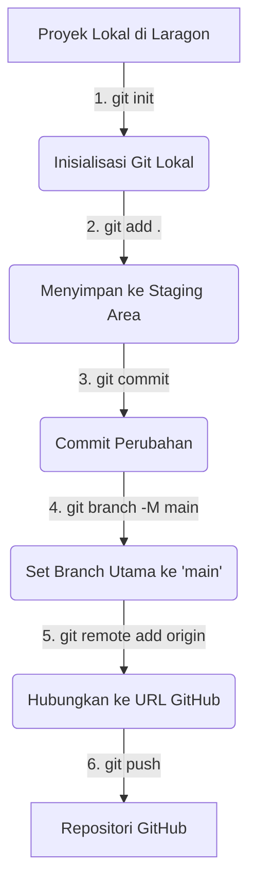

# 🚀 Panduan Lengkap Upload Project ke GitHub Menggunakan Git

Panduan ini dirancang khusus untuk membantu Anda mengunggah proyek skripsi Face Recognition ini dari komputer lokal ke GitHub dengan aman dan terstruktur.

---

> [!WARNING]
> ### 🔒 PENTING: PERINGATAN KEAMANAN TOKEN NGROK
> Di dalam file `api.py` baris ke-33, terdapat **`NGROK_AUTH_TOKEN`** Anda yang tertulis secara langsung (*hardcoded*):
> ```python
> NGROK_AUTH_TOKEN = "3CbaXiFH9fTIGACaMtPMEs5PHdC_5T6tW7Mvb41kzJCKXcRN"
> ```
> **Sangat disarankan untuk membuat repositori GitHub Anda menjadi PRIVATE** saat membuatnya nanti, agar token Anda tidak disalahgunakan oleh orang lain secara publik.

---

## 🗺️ Diagram Alur Proses Git

Berikut adalah visualisasi langkah-langkah yang akan kita lakukan untuk mengirim file dari komputer lokal Anda ke GitHub:



---

## 🛠️ Langkah-Langkah Upload Proyek ke GitHub

### Langkah 1: Persiapan di GitHub
1. Buka [GitHub](https://github.com) di browser Anda dan masuk ke akun Anda.
2. Klik tombol **New** (atau tanda **+** di pojok kanan atas lalu pilih **New repository**).
3. Isi informasi berikut:
   - **Repository name**: `skripsi` (atau nama lain yang Anda inginkan).
   - **Description** (Opsional): Deskripsi tentang proyek Anda.
   - **Visibility**: Pilih **Private** (Sangat disarankan agar token Ngrok Anda aman).
   - **Initialize this repository with**: **JANGAN centang** Add a README, Add .gitignore, atau Choose a license (biarkan kosong agar tidak terjadi bentrok konflik/merge).
4. Klik **Create repository**.
5. Salin (copy) link repositori HTTPS Anda yang baru dibuat. Contoh formatnya: `https://github.com/username-anda/skripsi.git`.

---

### Langkah 2: Menjalankan Perintah Git di Komputer Lokal

Buka Terminal/Command Prompt (CMD) atau PowerShell, arahkan ke folder proyek Anda (`C:\laragon\www\skripsi`), lalu jalankan perintah berikut secara berurutan:

#### 1. Inisialisasi Git Lokal
Perintah ini digunakan untuk membuat repositori Git lokal di dalam folder proyek Anda.
```bash
git init
```

#### 4. Tambahkan Semua File ke Staging Area
Perintah ini akan mendeteksi seluruh file proyek Anda. File-file sementara seperti cache python (`__pycache__`) akan otomatis diabaikan karena kita sudah membuat file `.gitignore`.
```bash
git add .
```

#### 3. Commit Pertama Anda
Gunakan perintah ini untuk membungkus perubahan Anda dengan label pesan tertentu.
```bash
git commit -m "first commit: inisialisasi project skripsi absensi wajah"
```

#### 4. Ubah Branch Utama Menjadi `main`
Secara default Git lokal kadang menggunakan `master`, perintah ini memastikan branch utama Anda bernama `main` (standar GitHub modern).
```bash
git branch -M main
```

#### 5. Hubungkan Git Lokal dengan Repositori GitHub
Ganti `https://github.com/username-anda/skripsi.git` dengan link HTTPS yang Anda salin dari Langkah 1 sebelumnya.
```bash
git remote add origin https://github.com/username-anda/skripsi.git
```

#### 6. Unggah Proyek Anda ke GitHub
Jalankan perintah ini untuk mulai proses transfer data ke GitHub.
```bash
git push -u origin main
```
*Catatan: Jika ini pertama kalinya Anda menggunakan Git di komputer tersebut, Anda mungkin akan diminta untuk login/otentikasi ke akun GitHub Anda melalui jendela pop-up.*

---

## 💡 Tips Penting Selama Pengembangan

* **File Model AI yang Besar:**
  File model Anda seperti `medium.pt` (33.5 MB) dan `model_face.pkl` (11 MB) masih aman diunggah langsung ke GitHub karena ukuran masing-masing di bawah batas maksimum GitHub (100 MB per file). Namun, jika di masa depan Anda melatih model baru yang ukurannya melebihi 100 MB, Anda harus menggunakan **Git LFS (Large File Storage)** atau mengecualikannya lewat `.gitignore` lalu mengunggahnya secara manual ke Google Drive.

* **Melakukan Update Code di Masa Depan:**
  Jika Anda telah melakukan perubahan pada file (misalnya mengedit `api.py` atau mempercantik tampilan HTML/CSS), Anda cukup menjalankan 3 perintah ini untuk memperbarui repositori GitHub Anda:
  ```bash
  git add .
  git commit -m "deskripsi singkat perubahan Anda"
  git push origin main
  ```
