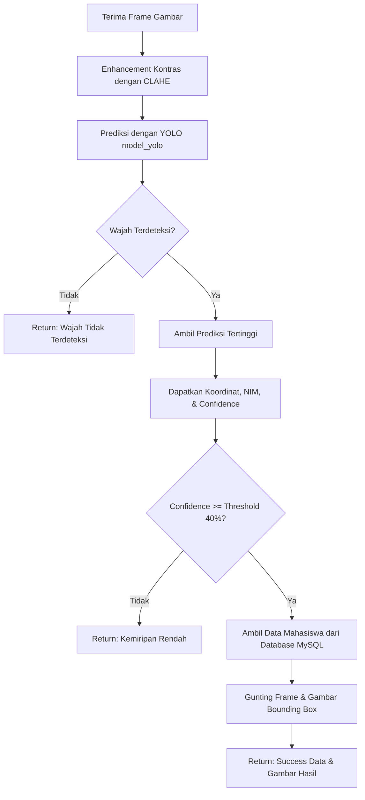

# Penjelasan Detail Algoritma dan Perhitungan Face Recognition (YOLO Direct)

Dokumen ini menjelaskan secara detail bagaimana sistem dalam `test_manual.py` dan `api.py` memproses sebuah gambar untuk mendeteksi wajah sekaligus mengenali identitas (NIM) beserta tingkat akurasinya menggunakan model YOLO (`medium.pt`) secara langsung.

Sistem ini telah disederhanakan dengan menghapus model ekstraktor fitur **FaceNet** dan klasifikator **SVM**. Sebagai gantinya, sistem sekarang menggunakan model **YOLO (You Only Look Once)** terpadu yang telah dilatih secara khusus untuk mendeteksi wajah sekaligus mengklasifikasikannya ke dalam kelas NIM masing-masing mahasiswa dalam satu kali evaluasi (*single forward pass*).

---

## 1. Alur Kerja Deteksi & Klasifikasi YOLO

YOLO adalah algoritma *object detection* berbasis *Deep Learning* (CNN - Convolutional Neural Network) yang memproses seluruh gambar secara simultan. 

1. **Input Gambar**: Gambar dari kamera/berkas masuk ke dalam sistem.
2. **Preprocessing**: Gambar diubah ukurannya dan dinormalisasi sesuai standar YOLO.
3. **Prediksi Sekaligus (Single Forward Pass)**:
   - Jaringan saraf YOLO mendeteksi letak wajah (*Bounding Box*).
   - Jaringan saraf YOLO memprediksi indeks kelas (*Class ID*) yang merepresentasikan identitas/NIM pemilik wajah tersebut.
   - Jaringan saraf YOLO menghitung skor keyakinan (*Confidence Score*) dari prediksi tersebut.

---

## 2. Output dan Perhitungan Matematis YOLO

Ketika baris kode `model_yolo.predict()` dijalankan, YOLO melakukan perhitungan matematika pada piksel gambar dan menghasilkan objek prediksi yang berisi:

### A. Koordinat Bounding Box ($x_1, y_1, x_2, y_2$)
Titik koordinat yang mendefinisikan lokasi wajah di dalam gambar asli:
- $x_1, y_1$: Koordinat piksel sudut kiri atas kotak wajah.
- $x_2, y_2$: Koordinat piksel sudut kanan bawah kotak wajah.

### B. Indeks Kelas (Class Index / ID)
Setiap mahasiswa terdaftar sebagai satu kelas dalam model YOLO:
- Kelas `0` $\rightarrow$ NIM `22533630`
- Kelas `1` $\rightarrow$ NIM `22533631`
- ... dan seterusnya.

Sistem langsung mengambil nama kelas asli (yaitu NIM) dari kamus kelas YOLO (`model_yolo.names`) menggunakan indeks kelas yang terdeteksi:
$$\text{NIM} = \text{model\_yolo.names[class\_index]}$$

### C. Skor Keyakinan (Confidence Score)
Skor probabilitas ($P \in [0, 1]$) yang menunjukkan seberapa yakin model bahwa objek tersebut adalah wajah milik orang (NIM) tersebut. Skor ini dikalikan dengan 100 untuk menghasilkan persentase akurasi yang ditampilkan di antarmuka pengguna:
$$\text{Akurasi (\%)} = \text{Confidence} \times 100$$

Jika skor keyakinan berada di bawah ambang batas (threshold) tertentu (misalnya $0.40$ atau $40\%$), sistem akan menganggap wajah tersebut tidak terdaftar (*Unknown* atau tidak dikenali).

---

## 3. Alur Logika Deteksi di Backend (`api.py`)

Berikut adalah urutan logika pemrosesan yang terjadi pada endpoint `/scan_face`:

---

## 4. Keuntungan Pendekatan YOLO Direct dibanding YOLO+FaceNet+SVM

1. **Kecepatan Komputasi Lebih Tinggi**: Dengan menghilangkan FaceNet dan SVM, sistem tidak perlu melakukan *crop* gambar wajah, melakukan transformasi ulang (Resize 160x160 & Normalisasi FaceNet), menjalankan forward pass model InceptionResnetV1 yang berat, lalu menjalankan klasifikasi SVM. Semua proses deteksi dan klasifikasi selesai dalam satu langkah oleh YOLO.
2. **Penggunaan Memori Lebih Hemat**: Server tidak perlu memuat model FaceNet (`InceptionResnetV1` berukuran ~100MB+ di memori) serta berkas model klasifikasi SVM (`.pkl`) dan Label Encoder (`.pkl`).
3. **Kemudahan Maintenance**: Struktur kode menjadi jauh lebih ringkas, bersih, dan meminimalkan ketergantungan pustaka eksternal (menghilangkan ketergantungan `facenet-pytorch`, `torchvision`, dan `joblib`).
